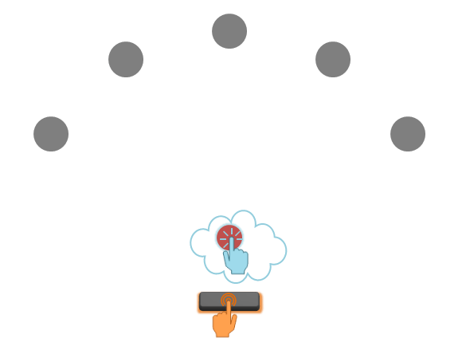
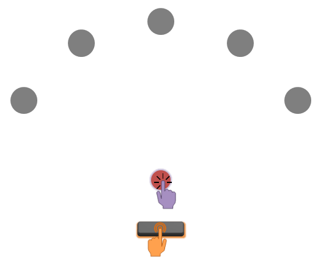

# Chronometric Radial Fitts' Task (CRFT)

Available in **English**, **German**, **Spanish**, **French** (see below for information on implementing the task in other languages).

The **Chronometric Radial Fitts' Task (CRFT)** [Czilczer et al., 2025](https://doi.org/10.31234/osf.io/c2mw6_v2) is a behavioural paradigm designed to assess the ability to manipulate movement imagery, approximated via imagery duration. It specifically measures the extent to which the relationship between movement difficulty and duration (through varying target size according to [Fitts' Law](https://doi.org/10.1037/h0055392)) is preserved in imagery compared to execution. The task was developed to address limitations associated with using the deviation between execution and imagery durations as an indicator of movement imagery ability.

If you are interested in assessing broader movement imagery ability, visit the [Movement Imagery Ability Platform](https://movementimageryability.github.io) for an overview of open-source behavioural tasks.

Example **imagery trial**:  
  
Example **execution trial**:  
  
_Refresh to replay animation._

## Repository information

This repository contains open-source materials for the most up-to-date versions of the CRFT. It links two folders representing [PsychoPy](https://www.psychopy.org/index.html) (`.psyexp`) and [OpenSesame](https://osdoc.cogsci.nl/) (`.osexp`) experiments, together with the associated files required to run them **locally** (lab/desktop experiments).

Please consult the accompanying manuscript ([Czilczer et al., 2026](DOI)) on the [Movement Imagery Ability Platform](https://movementimageryability.github.io) for guidance on the necessary steps to run the task locally in PsychoPy and OpenSesame. Furthermore, please read the version-specific **README** provided in the respective folders:
- [CRFT PsychoPy local](https://github.com/mmorenoverdu/CRFT/tree/main/CRFT)
- [CRFT OpenSesame local](/OpenSesame-local)

Subsequent updates to the native software (PsychoPy, OpenSesame) may require adjustments. As developers, we are not responsible for implementing these changes in every use case.

## Language expansion
If you want to contribute to this repository by providing a language translation, or want to run the task in your own language, expansions can be done relatively easily thanks to the implementation of language localisations (please read each README to understand how to implement these). You can also see these demos showing how to implement a language localisation in [PsychoPy](https://github.com/mmorenoverdu/language_localisation_demo) and [OpenSesame](https://github.com/carlacz/OpenSesame_Language-Localisation-Demo) with virtually no code.

